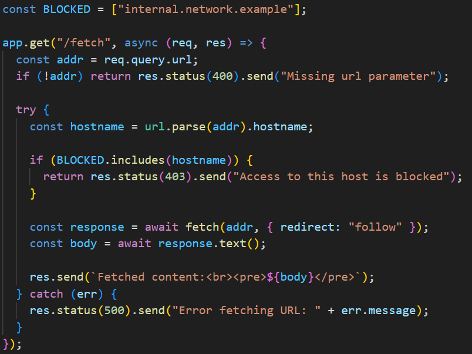

# Server-Side Request Forgery and Cross-Site Scripting Vulnerability Analysis

## Challenge Overview

This writeup analyzes a code vulnerability challenge presented by an X influencer, focusing on identifying security flaws in a web endpoint implementation. The challenge specifically asks participants to identify at least two serious vulnerabilities present in the provided code.

**Challenge Source:** [https://x.com/chux13786509/status/1962210900141654323](https://x.com/chux13786509/status/1962210900141654323)



## Code Analysis

The vulnerable code implements an endpoint that fetches content from user-submitted URLs. The endpoint includes several conditional checks that return different HTTP status codes based on the provided URL:

- **404 Error**: Returned when no URL is submitted in the request payload
- **403 Error**: Returned when the submitted URL matches entries in a predefined blocked list
- **500 Error**: Returned when a server error occurs during processing

## Identified Vulnerabilities

### 1. Server-Side Request Forgery (SSRF)

**Severity:** High

The primary vulnerability in this code is **Server-Side Request Forgery (SSRF)**. Despite implementing a blocked URL list, the endpoint performs insufficient validation on user-provided URLs before making HTTP requests.

#### Attack Vectors

An attacker can exploit this vulnerability to access internal services and resources that should not be publicly accessible, such as:

- **AWS Instance Metadata**: `http://169.254.169.254/latest/meta-data`
- **Internal Network Resources**: `http://xx.xx.xx.xx/internal-service`
- **Localhost Services**: `http://127.0.0.1:8080/admin`
- **IPv6 Localhost**: `::1`

#### Bypass Techniques

The vulnerability becomes more severe due to potential bypass techniques that can circumvent the basic blocked URL filtering:

1. **Case Manipulation**: Using mixed-case variations like `LoCaLhOsT` instead of `localhost`
2. **URL Encoding**: Utilizing encoded characters to obfuscate malicious URLs
3. **Alternative Representations**: Using different IP representations (decimal, hexadecimal, etc.)

#### OWASP Classification

According to the [OWASP Top 10 2021 - A10 Server-Side Request Forgery](https://owasp.org/Top10/A10_2021-Server-Side_Request_Forgery_%28SSRF%29/), SSRF vulnerabilities "allow an attacker to coerce the application to send a crafted request to an unexpected destination, even when protected by a firewall, VPN, or another type of network access control list (ACL)." This capability enables attackers to reach internal services or establish connections to external systems that should remain inaccessible.

### 2. Cross-Site Scripting (XSS)

**Severity:** High

The second critical vulnerability is **Cross-Site Scripting (XSS)**, which occurs in the response handling mechanism.

#### Vulnerable Code Pattern

The problematic code segment is:
```javascript
res.send(`Fetched content:<br><pre>${body}</pre>`);
```

#### Exploitation Scenario

This vulnerability allows an attacker to inject malicious scripts that will execute in users' browsers. The attack flow works as follows:

1. **Malicious URL Submission**: An attacker provides a URL that returns HTML content containing JavaScript code
2. **Script Injection**: The fetched content includes `<script>` tags with malicious JavaScript
3. **Code Execution**: When the response is rendered, the injected script executes in the victim's browser context

#### Example Attack

An attacker could host malicious content at their controlled domain that returns:
```html
<script>alert('XSS Vulnerability Exploited!');</script>
```

When this content is fetched and displayed through the vulnerable endpoint, the script will execute in the user's browser, potentially leading to:
- Session hijacking
- Credential theft
- Malicious redirects
- Data exfiltration

## Impact Assessment

### SSRF Impact
- Access to internal network resources
- Potential cloud metadata service exploitation
- Bypass of network security controls
- Information disclosure from internal services

### XSS Impact
- Client-side code execution
- Session compromise
- User credential theft
- Defacement and malicious content injection

## Recommended Mitigations

### For SSRF Prevention
1. **Implement strict URL validation** with allowlists instead of blocklists
2. **Use DNS resolution filtering** to prevent access to internal IP ranges
3. **Apply network segmentation** to isolate the application from sensitive internal resources
4. **Implement request timeouts** and response size limits

### For XSS Prevention
1. **Implement proper output encoding** for all user-controlled content
2. **Use Content Security Policy (CSP)** headers to restrict script execution
3. **Sanitize HTML content** before rendering
4. **Consider using text-only responses** instead of HTML when possible

## Conclusion

This challenge effectively demonstrates two critical web application vulnerabilities that frequently appear in real-world applications. The combination of SSRF and XSS vulnerabilities creates a significant security risk that could lead to both server-side and client-side compromises. Proper input validation, output encoding, and network security controls are essential to prevent such vulnerabilities in production applications.